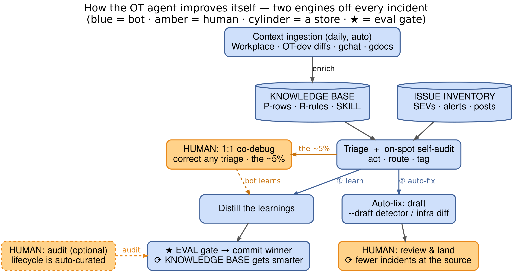
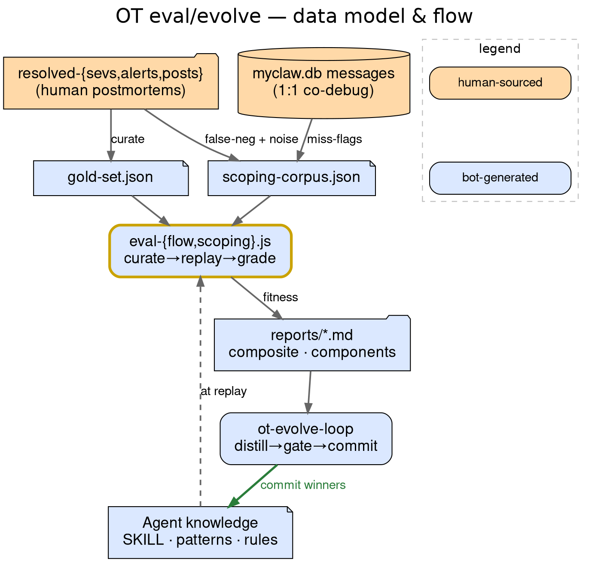

# OT agent — eval + self-evolve system

Measures the OT master agent against ground truth so it **keeps only changes that make it
measurably better**. The replay eval — the selection backbone — runs **on-demand**; improvement is **operator-directed** (both autonomous improve-loops, `ot-evolve-loop` + `ot-self-improve`, are **retired**; the triage monitors + gold-set curator keep running).

> **Status** — *Live:* triage monitors · the eval (runs + grades) · the executable gates (lint · leak-guard · ±0.03 noise-band · escalation) · OT-dev diff ingestion (wired into `ot-ingest-gdocs`, corpus seeded) · the auto-fix flywheel (autonomous drafts → human-land, ~13 landed/14d) · the weekly gold-set curator (added **+15** cases on its first run — the main driver of 60→77). *In progress:* owner-routing lookup (built; A/B pending) · proactive early-warning #3 (substrate built). *(Both autonomous improve-loops — `ot-evolve-loop` + `ot-self-improve` — are **retired**; improvement is operator-directed on-demand; eval runs on-demand.)* Numbers below are noisy single-build estimates — see Scoreboard.
>
> **Start here:** new? **The goal** → **Key challenges** → the diagram. Operator? **The system, box by box**. Hacking it? **Deep dive**.

---

## The goal

What the agent must deliver for the OT lane (the *how* is in **Key challenges** + **The system**). Each line: goal · metric · maturity.

1. **Cheap recurring-issue debug.** Same failure ≥3× → root cause in **≤5 min** (P-row lookup, not re-debug). *Metric:* time-to-root-cause. ✅ **live + measured** — monitors stamp `ts_root_cause`, refreshed daily (`ot-metrics-rollup`); latest backtest **100% of known-pattern triages ≤5 min** (15 events).
2. **Recurring → auto-improvement.** Owned area → a `--draft` auto-fix diff; dependency → an auto-filed task with a decisive metric query (not a re-narrated symptom). *Metric:* owned recurrences landed; dep tasks accepted-not-bounced. ✅ the auto-fix **flywheel** drafts across paths (prevention · detector-fix · alert-widen · distill): **~28 diffs / 14d → 13 landed** (human-reviewed), 12 abandoned (mostly *correct* no-mask refusals), 3 open.
3. **Make urgent less urgent.** Auto-explore patterns, emit early signals before they page — and own their precision (a dud signal counts against it, else it becomes #4's noise). *Metric:* lead time at a bounded false-alarm rate. ◐ *reactive* shift-left already happens — detectors/alerts added **after** an incident (~11 such flywheel diffs); the **autonomous proactive** loop (signal before first page) is not built — needs #4's trend substrate.
4. **Catch novel patterns — and noise.** New pattern → escalate to a human; known-spammy → suppress (TTL). *Metric:* novels/week at a capped false-positive rate. ◐ substrate **built** (`trend-novelty.sh`: novel + noise candidate lists, report-only; verified 10 novel / 2 noise). Turning it into an autonomous early-warning *loop* (#3, paging) is the remaining gated piece — *your* switch.

---

## Key challenges

Three root *challenges* in delivering the above **autonomously and safely** — each met by a built mechanism, not a good intention. They chain: encode scarce human judgment **(1)** into a trustworthy gold set **(2)** that catches the mistakes a human would **(3)**.

1. **Expert judgment doesn't scale.** One person can't review every triage or self-rewrite, yet the agent is only as good as that judgment. *Fix:* encode it **once** (fitness function + corrections); the eval applies that bar to every change. Humans stay minimal but authoritative — in the loop only for the irreversible/unproven; **prod is the final judge**.
2. **Only as good as the gold set — and good ground truth is scarce.** Selection, drift-detection, and anti-gaming all rest on it; too few / leaky / stale / gameable cases make the eval theater and let a self-optimizer tune to the test. *Fix:* a managed **lifecycle** — auto-curator adds confirmed-RCA cases, a **leak-guard** strips the answer, curation **blind to scores** over a **frozen** corpus + **codex co-grader** — so scoring higher means actually being better.
3. **Silent, repetitive mistakes recur.** No reviewer → a confident wrong answer ships unseen; a prose "remember to…" gets skipped under task focus (an LLM can fake that it complied). *Fix:* **executable gates every run** — lint/validator/leak-noise harness, a hallucination **hard gate**, calibration top-weighted (a bigger model doesn't fix this — per A/B). Each caught mistake becomes a permanent gate; the **two engines** close the incident loop (learn → smarter triage, auto-fix → retire the class).

---

*Two stores (issue inventory · knowledge base), two engines off every incident — **① knowledge:** mine → distill → ★ eval (keep winners) → commit → smarter triage; **② auto-fix:** draft an infra diff → fewer incidents at the source. Blue = bot · amber = the few human touchpoints.*

---

## The system, box by box

Each box → what runs it → what reaches **your** queue (not raw alerts):

- **Context ingestion** — `ot-ingest-gchat` / `-posts` / `-gdoc` (gdocs · fbsource skills · **OT-dev authored diffs**) → *nothing* (keeps the KB current).
- **Issue inventory** — `incidents/resolved-{sevs,alerts,posts}/` (`ot-*-mitigated-*`, `ot-triage-summary`) → *nothing*.
- **Knowledge base** — `known-patterns.md` · `triage-discipline.md` · `SKILL.md` + known-issues registry (`add-known-issue.sh`, TTL) → *nothing*.
- **Triage + self-audit** — `ot-sev-monitor` / `ot-alert-monitor` / `ot-post-monitor` + validator panel (`ot-triage-auditor`) → the **~5%** it can't resolve.
- **Auto-fix** — `ot-autofix-diff-drafter` → an **`[OT auto-fix]` task + `--draft` diff** to land (never auto-land).
- **Distill** — `ot-knowledge-distillation` / `ot-knowledge-curation` → a **new P-row / R-rule** (≥3 bar); sub-bar waits in `learnings-ledger.md`.
- **★ EVAL** — `eval-flow.js` / `eval-scoping.js` + `gold-set.json` + `ot-eval-goldset-curator` → *nothing* (the selection gate).
- **Improvement** — operator-directed / on-demand (the autonomous improve-loops `ot-evolve-loop` + `ot-self-improve` are **retired**); eval runs on-demand → eval-proven commits + draft fixes.
- **Daily** — `reports/` (fitness · diff-ledger · escalation-rate) → trends to watch.

Net: your queue gets eval-proven commits, draft diffs to land, and auto-fix tasks — not raw alerts.

---

## Scoreboard (2026-06-12, 2-run mean)

Full composite **≈ 0.76** — a calibration-weighted blend of **5 dims**: 3 from triage replay (calibration · owner · decisiveness, ≈65% wt) + detection & scoping (≈35%) from the scoping eval, renormalized over covered dims. **Noisy** ±0.03 between identical runs (n≈56–59 graded), so values are ranges; the loop rejects gains inside that band (`eval-stats.sh`).

- **calibration — 0.79** (.35): `1 − (correct − confidence)²`; confident-and-wrong hit hardest.
- **detection recall — 0.83** (.20): scoping corpus now **frozen** so runs compare (a prior 0.96 was corpus drift, not a real win).
- **scoping precision — 1.00** (.15): drops 100% of out-of-scope — but on **out-of-org negatives only**; likely <1.0 with in-MRS noise.
- **owner routing — 0.36** (.15): weakest dim; likely input-ceilinged.
- **decisiveness — 0.72** (.15): commits to a verdict vs hedging.
- **hallucination — ~0.14** (**hard gate**, not weighted): zeroes ~14% of cases; prompt/knowledge-driven, not model-size.

Separate signals: **delivery 0.91** · **proposal precision ~62% land / 35% abandon** (~205 diffs, `reports/diff-ledger.md`) · **escalation target ≤5%**. Weakest **components**: scope-detector ~0.67, T2-training ~0.63 (the loop's current targets).

---

## Track record (honest)

- **Built & working:** the eval harness (runs + grades vs truth), the gold-set tool (60 → 77 cases via evolve-loop), the gates (lint · leak-guard · noise-band · escalation · known-issues/expected-delta tiers).
- **Real gain landed:** R22 (eval-proven R-rule) lifted detection_recall **0.42 → 0.96** on the then-corpus — frozen corpus now reads **~0.83** (0.96 was pre-freeze drift); plus early R19 / GRADE-schema fixes.
- **Stuck (don't oversell):** *knowledge-rule* generation for the hard dims — **owner-routing, decisiveness** — ~8 rounds rejected, **0 landed** (killed at the eval gate). This is the R-rule path only — **distinct from the infra-diff flywheel above, which lands ~13/14d**. Owner-routing → moving to a deterministic lookup.
- **Proposal precision:** the autonomous **OT-flywheel** drafts **~28 diffs / 14d → 13 landed** (human-reviewed), 12 abandoned, 3 open (Stage-1c ledger). *Read "abandoned" as the guardrail working* — e.g. D107959319 was correctly killed because removing the detector would have masked 194 real violations. (All-time bot diffs ~205 / 62% land blend in interactive work.)

---

## Next — close the exposed gaps (by leverage)

1. **Eval runs end-to-end** — ✅ **shard mechanism proven**: a 5-case shard ran via Workflow → real composite **0.786** (hallucination 0, `partial:true` correct), not the `0.209` garbage; fixed a `new Date()` crash (Workflow bans it). The scheduled daemon eval (`ot-evolve-loop`) is now **disabled** — eval runs **on-demand**; the harness itself is proven.
2. **Instrument the three blind metrics** — ✅ time-to-root-cause (#1) wired + daily + 100%≤5min; ◐ novels/week (#4) substrate built (`trend-novelty.sh`); 🎯 early-signal lead time (#3) still unbuilt (needs the proactive loop).
3. **Land one autonomous fix** — close engine 2's owned→diff loop once, to prove *generation* works, not just selection.

---

## Limits & where you help

- **Unblock the loop (you):** ✅ **fitness weighting** validated (objective locked) · **gold-set labels** — optional audit (`gold-set-review-queue.sh`) · **owner-routing** — lookup built (`owner-lookup.sh`), A/B pending · **auto-commit trust bar** — ✅ auto-commit, operator-confirmed.
- **Ceilings (fix in flight):** **no owner input** — the incident owner's postmortem RCA is ignored → harvest it as a correction signal + route the bot's call to the owner to confirm (read-only). **Mostly reactive** — acts only after ≥3 recurrences → early-warning on metrics trending toward a SEV.
- **Hard constraints:** offline↔online correlation now **tracked** vs training-example-age (`eval-online-correlate.sh`) — accruing (~6d to first r; r≤−0.4 ⇒ eval trustworthy, r≈0 ⇒ overfitting → halt) · eval harness proven (shard → composite 0.786); scheduled daemon eval (`ot-evolve-loop`) **disabled** — eval on-demand · gold-set labels are proxies · owner-routing may be input-ceilinged · only **measured** behaviors improve · external surfaces read-only.

---

## Deep dive

*Replay eval* = take a resolved incident, hide the answer, re-triage, grade vs ground truth. Distillation is the **only writer** of P-rows/R-rules (dedup · ≥3 bar · ≤1 diff/run · eval-gated).

**Eval & gold set**
- **Corpus:** `gold-set.json` = **77 cases** (31 alert · 27 post · 19 SEV), cap 180; `scoping-corpus.json` = 62 (frozen). Ground truth = the **confirmed** RCA, never the bot's prior output.
- **Stable inputs:** frozen so a score delta = an agent change, not corpus churn; A/B via `args:{inject_rule:"…"}` (same gold-set version both arms).
- **Grading:** an independent grader re-runs the ground-truth queries (MATCH/PARTIAL/MISS → 1/0.5/0). *(Cross-model **codex** review is a separate adversarial pass on code/diff-bearing triage — the validator + pre-submit diff review — **not** wired into this eval grader yet.)*
- **Lifecycle:** `ot-eval-goldset-curator` (weekly) appends confirmed-RC incidents via `gold-set-curate.sh` — leak-free input, dedup, version-bump, cap 180, strata-balance, SAFE-prune only, **blind to eval scores**. State: 77 cases; the curator **added +15 posts on its first run** (2026-06-12) — the main driver of 60→77; next run targets the now-under-represented `sev` stratum (88 in backlog).

**Commit & human review**
- **Gate is on the WRITE, not a timer:** only an eval-winner (composite up, zero regression, codex-checked) is written; losers never are. The hourly `ot-notes-commit-push` persists whatever's on disk — *not* eval-gated, which is why a loser must never be written.
- **Auto-commit vs wait:** knowledge/prompt changes commit autonomously; real-system changes (configerator/fbcode) go `--draft` for a human (≤1 diff/run).
- **Escalation = the ≤5% metric:** each incident routes `auto` or `human`; `record-triage-event.sh --routed-to` → `escalation-rate.sh`. Target ≤5% human.

**Knowledge / memory tiers**
- `known-patterns.md` (P-rows) — symptom→cause→fix; next hit triages instantly. ≥3 bar.
- `triage-discipline.md` (R-rules) — reasoning fixes so a miss doesn't repeat. ≥3 bar.
- `learnings-ledger.md` — waiting room for a <3-hit candidate.
- **known-issues registry** — suppress a known-noise `(model, signal)` with a **TTL** (re-surfaces on expiry).
- `SKILL.md` + `src/capabilities/` — the engine (decision matrix, SLO targets); reusable logic, not in cron prompts.
- Bot self-memory (`memory/*.md`) — durable operator-feedback facts, recalled each session.
- Ingested context corpus — Workplace / **OT-dev authored diffs** (`references/diffs/`, change-metadata only, feeds the change-delta-first triage step; corpus seeded ~659 diffs / 46 owners, roster = key OT people (`references/key-people.json`, person-centric / trust-tiered; was the `mrs_online_training` oncall), daily auto-sync via `ot-ingest-gdoc`) / gchat / gdocs / meeting-notes / fbsource skills synced daily (`ot-ingest-*`).

**Pointers**
- Harnesses at `~/.myclaw-ot-bot/eval-*.js`: `eval-flow.js` (triage) · `eval-scoping.js` (engage/drop) · `eval-delivery.js` (post quality). Run: `Workflow {scriptPath:"…/eval-flow.js"}` (`args:{inject_rule:"…"}` to A/B).
- Data flow & files (diagram below) — corpora `gold-set.json` / `scoping-corpus.json`; reports in `reports/`; loop spec `evolve-loop.cron.md`.
- ⚠️ Diagram/harness **sources** (`.js`/`.dot`) live in `~/.myclaw-ot-bot/`; only `.png`/`.txt` mirrors here — never commit `.js`/`.dot` to notes (stalls the auto-push).

