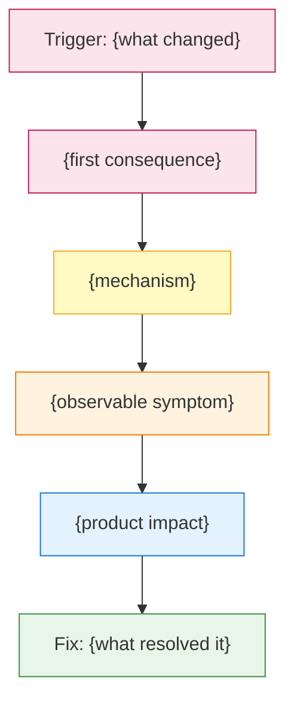
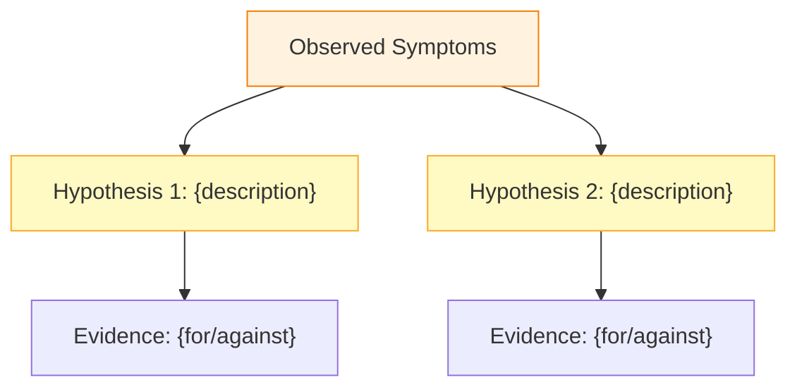

# Response Templates, Visualization & Validators

Load this reference when generating a structured SEV report (either complete or active investigation).

## Table of Contents

- [Template A: Complete SEV -- SEV Manager Section Content](#template-a-complete-sev----sev-manager-section-content)
- [Template B: Active SEV -- Draft Section Content](#template-b-active-sev----draft-section-content)
- [Visualization Requirements](#visualization-requirements)
- [Success Criteria & Validators](#success-criteria--validators)

## Template A: Complete SEV -- SEV Manager Section Content (Root Cause Known)

### Incident Impact

**Confidence:** {High/Medium/Low confidence}

**Evidence basis:** {what data supports this -- e.g., "SEV comments by {owner} on {date}, Scuba error rate data"}

{Suggested content for the Incident Impact field. Include: affected models with IDs, metric regressions with numbers, duration, downstream SEVs.}

---

### Detection

**Confidence:** {High/Medium/Low confidence}

**Evidence basis:** {what data supports this}

{How it was detected: alert name/type, who noticed first, initial symptoms observed, time from incident start to detection. Include OneDetection alert links if available.}

---

### Root Cause

**Confidence:** {High/Medium/Low confidence}

**Evidence basis:** {what data supports this}

{One-paragraph root cause summary. Concise enough for a SEV review slide. Should answer: what changed, why it broke things, what was the mechanism.}

---

### Root Cause Detail

**Confidence:** {High/Medium/Low confidence}

**Evidence basis:** {what data supports this}

**Causal Chain Diagram:**

{Full technical explanation with diff links, causal chain, and code references.}

**Hypotheses Explored:**

| # | Hypothesis | Evidence For | Evidence Against | Verdict |
|---|-----------|-------------|-----------------|---------|
| 1 | {hypothesis} | {supporting} | {contradicting} | Confirmed / Ruled Out |

**Causal Chain:**

{trigger} -> {mechanism} -> {symptoms} -> {user impact}

---

### Remediation

**Confidence:** {High/Medium/Low confidence}

**Evidence basis:** {what data supports this}

**Immediate Mitigation:** {what was done first to stop the bleeding, with timestamps}

**Definitive Fix:** {the permanent solution -- diff link, configuration change}

**Verification:** {how the fix was confirmed -- Vanguard tests, monitoring dashboards}

---

### Prevention

**Confidence:** {High/Medium/Low confidence}

| # | Action | Type | Owner | Task | Priority |
|---|--------|------|-------|------|----------|
| 1 | {action} | Detection / Prevention / Process / Infra | {name} | T{id} | Critical / Important / Nice-to-have |

---

### Escalations

**Confidence:** {High/Medium/Low confidence}

**Evidence basis:** {what data supports this}

**Severity Level Changes:**

| Timestamp | From | To | Initiated By | Justification |
|-----------|------|----|-------------|---------------|
| {time} | {old level} | {new level} | {who} | {why} |

**Cross-Team Escalations:**

| Timestamp | From Team/Oncall | To Team/Oncall | Reason |
|-----------|-----------------|---------------|--------|
| {time} | {source} | {target} | {why escalated} |

**Management Escalations:** {description or "None"}

**Escalation Timeliness Assessment:** {Was escalation prompt? Any delays that impacted resolution time?}

---

### Report (Narrative)

**Confidence:** {High/Medium/Low confidence}

{Full narrative story from detection through resolution. Suitable for the SEV Manager "Report" field.}

---

### Supporting Analysis (Reference Material -- not for direct paste into SEV Manager)

**Daily Timeline Summary:**

| Day | Phase | Key Events | End-of-Day Model State |
|-----|-------|------------|------------------------|
| {date} | {phase label} | {1-2 sentence summary} | {model states} |

**Detailed Timeline:**

| Date/Time | Event | Owner |
|-----------|-------|-------|
| {timestamp} | {event description} | {who} |
| **FINAL STATE** | **{summary of all models' current config}** | Stable / Degraded / Broken |

**Affected Models:**

| Model ID | Name | Impact |
|----------|------|--------|
| m{id} | {name} | {description} |

**Key Terms:**

| Term | What It Means in This SEV |
|------|--------------------------|
| {term} | {explanation specific to this SEV's context} |

**Key References:**

- Investigation Doc: {link}
- Bad Diff: {link}
- Fix Diff: {link}
- Monitoring Dashboard: {link}

**Baseline Update Suggestions:**

{If this SEV provides new metric baseline data, note it here.}

---

## Template B: Active SEV -- Draft Section Content (No Root Cause Yet)

Note: This SEV is still in progress. All sections below are drafts based on available data as of {latest_timestamp}. Review and update before submitting.

### Incident Impact (Draft -- verify before submitting)

**Confidence:** {High/Medium/Low confidence}

**Evidence basis:** {what data supports this}

{Draft impact description based on available comments and data.}

**Oncall note:** Verify final impact numbers once incident is fully resolved. Check for additional downstream SEVs.

---

### Detection (Draft -- verify before submitting)

**Confidence:** {High/Medium/Low confidence}

**Evidence basis:** {what data supports this}

{How it was detected based on available information.}

**Oncall note:** Confirm the exact alert name and detection timestamp.

---

### Root Cause (Draft -- verify before submitting)

**Confidence:** {Low confidence}

Root cause is still under investigation.

**Current leading hypothesis:** {best hypothesis based on available evidence}

**Evidence supporting this:** {supporting data}

**What would confirm/rule out:** {what additional investigation is needed}

**Oncall note:** Update this once root cause is confirmed.

---

### Root Cause Detail (Draft -- verify before submitting)

**Confidence:** {Low confidence}

**Hypothesis Diagram:**

**Hypotheses Under Investigation:**

| # | Hypothesis | Evidence For | Evidence Against | Status |
|---|-----------|-------------|-----------------|--------|
| 1 | {hypothesis} | {supporting} | {contradicting} | Active / Ruled Out |

**What Has Been Tried:**

| # | Action | Result | Conclusion |
|---|--------|--------|-----------|
| 1 | {action taken} | {what happened} | {what we learned} |

**Oncall note:** Update hypothesis table as investigation progresses. Mark confirmed root cause when identified.

---

### Remediation (Draft -- verify before submitting)

**Confidence:** {Medium/Low confidence}

**Current mitigation:** {what is currently in place, or "NONE -- immediate action needed"}

**Definitive fix:** Pending root cause confirmation

**Oncall note:** Update with definitive fix details once deployed and verified.

---

### Prevention (Draft -- verify before submitting)

**Confidence:** {Low confidence}

| # | Action | Type | Owner | Task | Priority |
|---|--------|------|-------|------|----------|
| 1 | {preliminary action based on investigation so far} | {type} | TBD | TBD | TBD |

**Oncall note:** Finalize prevention actions after root cause is confirmed. Assign owners and create tasks.

---

### Escalations (Draft -- verify before submitting)

**Confidence:** {Medium/Low confidence}

**Evidence basis:** {what data supports this}

**Severity Level Changes (so far):**

| Timestamp | From | To | Initiated By | Justification |
|-----------|------|----|-------------|---------------|
| {time} | {old level} | {new level} | {who} | {why} |

**Cross-Team Escalations (so far):**

| Timestamp | From Team/Oncall | To Team/Oncall | Reason |
|-----------|-----------------|---------------|--------|
| {time} | {source} | {target} | {why escalated} |

**Oncall note:** Update with final escalation details. Confirm all level changes and cross-team handoffs.

---

### Report (Draft -- verify before submitting)

**Confidence:** {Medium confidence}

{Draft narrative based on what is known so far. Clearly marks what is confirmed vs. under investigation.}

**Oncall note:** Rewrite this section once the incident is fully resolved.

---

### Supporting Analysis (Reference Material)

**Current Situation:**

- **Status**: {In Progress / Investigating}
- **Duration so far**: {time since detection}
- **Current mitigation**: {what's in place}
- **Severity**: {level and any changes}

**Live Model State (as of {latest_timestamp}):**

| Model | Binary | In-Place | Warmup | Error Rate | Last Snapshot |
|-------|--------|----------|--------|------------|---------------|
| {model_name} ({id}) | v{version} | On / Off | Enabled / Skipped | {rate}% | {snapshot_id} at {time} |

Warning: This table reflects the LAST known state. Re-check SEV Manager and Scuba before taking action.

**Daily Timeline Summary:**

| Day | Phase | Key Events | End-of-Day Model State |
|-----|-------|------------|------------------------|
| {date} | {phase label} | {1-2 sentence summary} | {model states} |

**Detailed Timeline:**

| Date/Time | Event | Owner |
|-----------|-------|-------|
| {timestamp} | {event description} | {who} |

**Key Terms:**

| Term | What It Means in This SEV |
|------|--------------------------|
| {term} | {explanation specific to this SEV's context} |

**Suggested Next Steps (Prioritized):**

**Immediate (if no mitigation in place)**
- {mitigation action}

**Investigation (to identify root cause)**
- {debugging step}

**Data Collection (for future analysis)**
- {data action}

**Similar Past SEVs:**

{List any SEVs with similar symptom patterns}

**Key Resources:**

- Investigation Doc: {link if exists}
- Monitoring Dashboard: {link}
- Workchat: {link}
- Oncall: {current runtime oncall}

---

## Visualization Requirements

- Use timeline tables for chronological event sequences
- Use comparison tables for before/after metrics (error rates, latency, warmup times)
- Use model impact tables with model IDs, names, and specific impact descriptions
- For metric movements, show actual numbers (e.g., "warmup regressed from 100ms to 8,000ms = 80x slowdown")
- When showing hypothesis tables, clearly mark the Verdict column as Confirmed/Ruled Out/Active
- Daily Timeline Summary uses phase labels: Detection, Investigating, Partial Mitigation, Fix Attempted, Resolved, Escalated
- Include Mermaid causal chain diagrams in Root Cause Detail section for confirmed root causes
- Include Mermaid hypothesis diagrams for active SEVs with 2+ hypotheses
- Use standard color coding in diagrams: red=trigger, yellow=mechanism, orange=symptom, blue=impact, green=fix

## Success Criteria & Validators

Every SEV report MUST satisfy:

1. Generate suggested content for all 8 SEV Manager report sections: Incident Impact, Detection, Root Cause, Root Cause Detail, Remediation, Prevention, Escalations, Report
2. Each section MUST include a confidence indicator (High/Medium/Low) and evidence basis
3. The agent MUST NOT use content from existing SEV Manager report fields (`Incident Impact`, `Report`, `Root Cause`, `Root Cause Detail`, `Detection`, `Remediation`, `Prevention`, `Escalations`) as analysis input
4. Timeline must have at least 5 chronological entries with timestamps
5. Root cause section should include at least one diff link or code reference
6. Impact section must list specific model IDs (m######) for all affected models
7. Prevention actions must each have a Type classification and Owner
8. If the SEV mentions a binary version, include both the bad and good version numbers
9. If error rates are mentioned, include the peak error rate percentage
10. For active investigation reports, "Suggested Next Steps" must have at least one item in each priority tier (Immediate/Investigation/Data Collection)
11. Never present a hypothesis as a confirmed root cause -- always distinguish them clearly
12. For active SEVs, all SEV Manager sections must be marked "Draft" with oncall notes
13. The Report (Narrative) section must tell a coherent story from detection through resolution
14. Supporting Analysis (timeline, model table) must still be generated as reference material
15. If SEV status is "In Progress" and last update is >24 hours old, report MUST include a stale data warning
16. Detailed Timeline MUST include a "FINAL STATE" row summarizing the last known configuration of all affected models
17. Every response MUST include a "Daily Timeline Summary" table with one row per active day, phase classification, and end-of-day model state
18. Daily Timeline Summary MUST use the standard phase labels: Detection, Investigating, Partial Mitigation, Fix Attempted, Resolved, Escalated
19. Every SEV report MUST include a "Key Terms" table in Supporting Analysis with at least 3 terms relevant to the specific SEV
20. Every SEV report with a confirmed root cause MUST include a Mermaid causal chain diagram in the Root Cause Detail section
21. Active SEV reports MUST include a Mermaid hypothesis diagram if there are 2+ active hypotheses
22. Key Terms explanations MUST be tailored to the specific SEV context, not generic definitions
23. Causal chain diagrams MUST use the standard color coding (red=trigger, yellow=mechanism, orange=symptom, blue=impact, green=fix)
24. Diagrams MUST have 8-15 nodes maximum
25. Escalations section must include at least one severity level change entry with timestamp, or explicitly state "No severity level changes during this incident"
